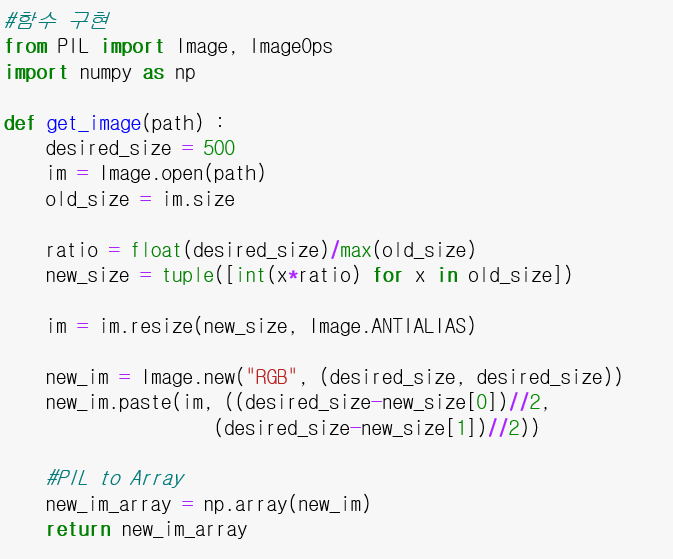
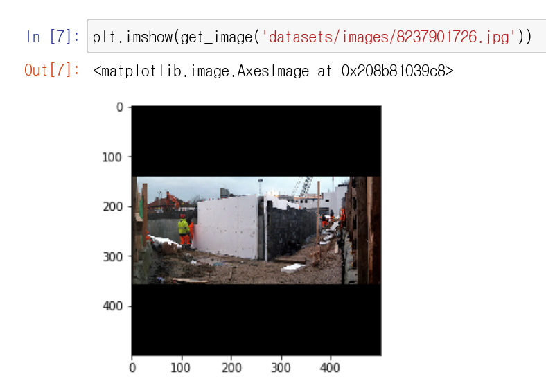
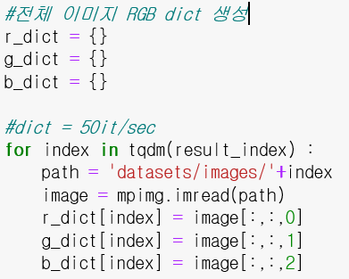
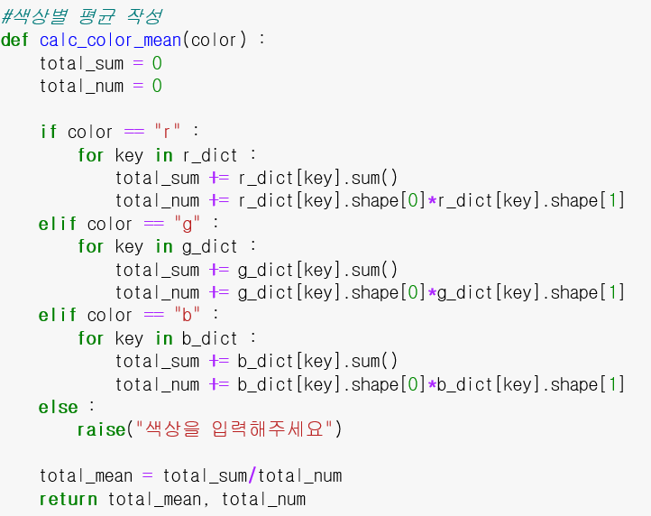
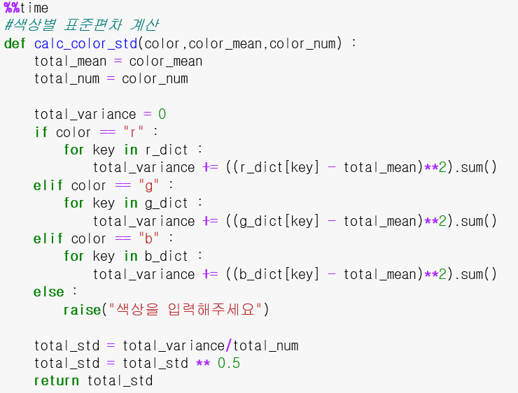
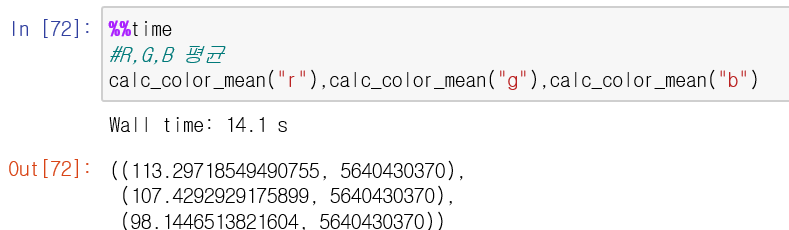
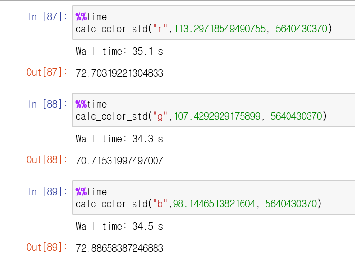
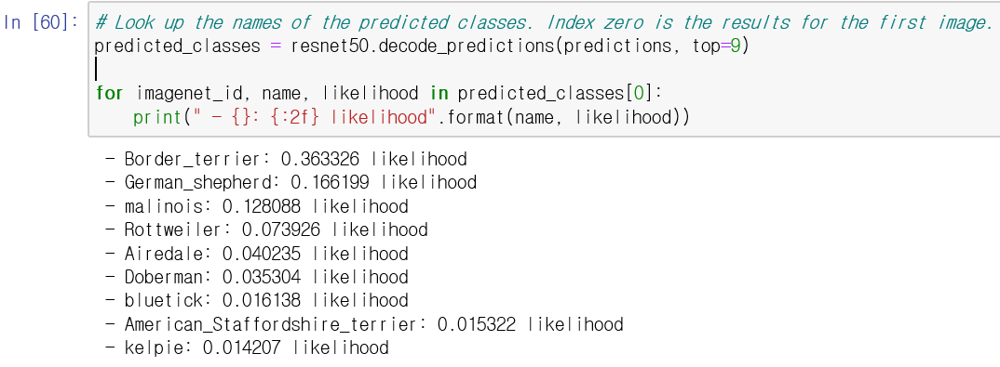

# __SSAFY AI Project__

---

## :strawberry: Installation 

---

- All the clone `code` required to get started
- Download image data : [https://i02lab1.p.ssafy.io/images.zip (4.07GB)](https://i02lab1.p.ssafy.io/images.zip)

## :arrow_forward: Execution

---

## :memo: Requirement

---

### Req 1-1. 이미지 파일 로드

이미지 파일을 로드하는 함수를 구현한다 

  

이미지의 최대 크기가 가로세로 500,500임을 확인해 자동으로 빈 공간을 zero-padding해준다. 

구현된 결과는 아래와 같다. 

### Req 1-2. 이미지 RGB 정규화

이미지 전체의 평균,표준편차를 아래와 같은 코드로 계산한다 

 

 

  

계산된 결과는 아래와 같다. 

평균 :

 

표준편차 :  

### Req 4-1. Encoder 모델

사용방법 : Req4.py를 실행시킨다. --img_path 옵션으로 추출하고자 하는 이미지의 경로를 설정한다. 

기본적으로 강아지의 사진을 입력받는다. 

출력으로는 마지막 Dense Layer에서 추출하는 (1,1000) 벡터를 출력한다.

강아지의 사진을 분류한 결과는 아래와 같다. 

## :newspaper: Document

---

- ### CNN

  - [CNN이란](./doc/CNN/CNN이란.md)

  - [CNN-최신모델](./doc/CNN/CNN-최신모델.md)

  - [CNN_improvement_technique](./doc/CNN/cnn_improvement_technique.md)
  - [모델 학습과정 시각화](./doc/CNN/모델_학습과정_시각화.md)
  - [모델의 랜덤성과 저장](./doc/CNN/모델의_랜덤성과_저장.md)
  - [Image Data Preprocessing](./doc/CNN/Image Data Preprocessing.md)
  - [Jupyter Notebook](./doc/CNN/)

- ### RNN

  - [1-1 한국어 형태소 분석기 비교](./doc/RNN/1-1_한국어 형태소 분석기 비교.md)
  - [1_Tokenization](./doc/RNN/1_Tokenization.md)
  - [2_Integer Encoding](./doc/RNN/2_Integer Encoding.md)
  - [3_WordEmbedding](./doc/RNN/3_WordEmbedding.md)
  - [4_Recurrent_Neural_Network](./doc/RNN/4_Recurrent_Neural_Network.md)
  - [5_LSTM](./doc/RNN/5_LSTM.md)
  - [RNN_텍스트생성](./doc/RNN/RNN_텍스트생성.md)

  - [Tokenization](./doc/RNN/tokenization.md)

- ### Git Conventions

  - [MCJ Git Conventions](./doc/Git_conventions/MCJ Git Conventions)

## :date: Jira

- https://jira.ssafy.com/projects/S02P22A401/